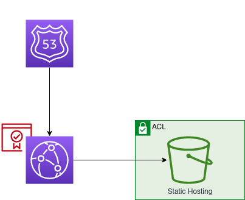

# AtikaRooms Webpage Infrastructure

Repository of the AtikaRooms Webpage Infrastructure served on {{TBD}}. It is based on Terraform that build in a simple to understand and reproducible way an S3 Bucket, a Cloudfront distribution, a certificate on Amazon Certificate Manager and all necessary Route 53 records.



## Requirements

* [Docker](https://docs.docker.com/engine/install/)
* [Docker Compose](https://docs.docker.com/compose/install/)
* [Make](https://www.gnu.org/software/make/)

## Development

First of all you will need to fill two environment files:
* `./.env` contains details of the project, is used by the `docker-compose.yml` file
* `./docker/environment/development.env` is for AWS credentials, in order to work in the project you will need at least read access to the Terraform remote state file

Example files are provided to help you out filling the environment files.

This project is provided along with a development container that will include all necessary technologies to start developing comfortably. If you use VS Code along with the Remote - Containers extension you will be able to connect your IDE inside the development container and therefore not installing extra dependencies on your machine.

If you are not using VS Code or have access to mentioned extension you still can use the handy Makefile provided.

To start the development container and start a tty on it:

```
make start
```

Once inside the development container, you can make use of the Makefile to shorten typical Terraform commands, check the Makefile documentation to find them.

```
make help
```

## Deployment

TODO: Set & Explain Github Actions
Main idea is to set Github Actions so all infrastructure modifications are performed from Github.
